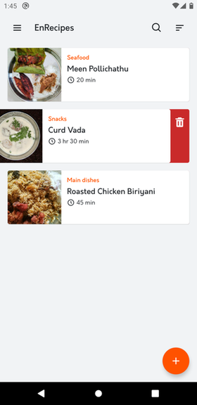
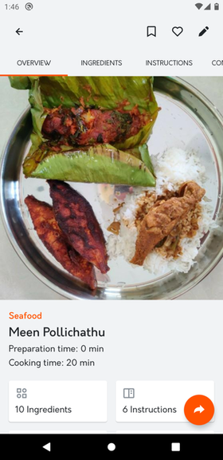
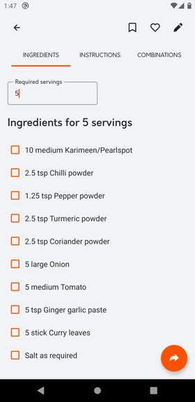
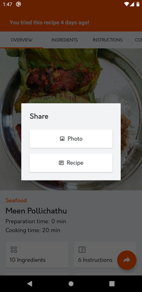
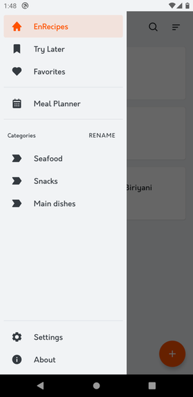
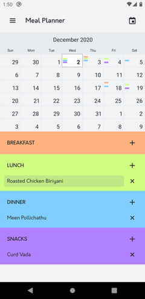
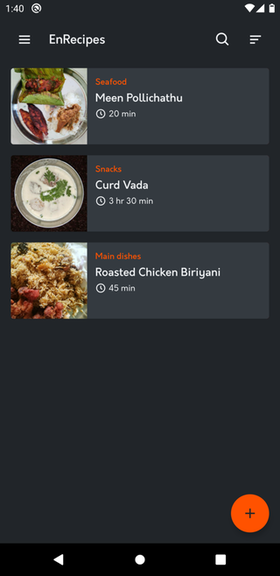

# EnRecipes

> A simple, offline recipe manager.

## Introduction

EnRecipes is an easy to use, privacy-friendly digital cookbook that lets you create, manage and share your own recipes.

## Principles

- Privacy by Design

## Technologies

- NativeScript-Vue

## Assets

- [Boxicons](https://boxicons.com/)
- Logo by [Vishnu Raghav](https://www.vishnuraghav.com/)

## Features

- Create recipes quickly
- Add photo, notes and combinations to your recipes
- Organise your recipes by category
- Quickly search for your recipes
- Mark recipes as favorites and add them to your Try Later list
- Scale your recipe ingredients to serve more or less people
- Get notified of the last time you tried a recipe
- Share your recipe to anyone by any means as a nicely formatted message. You can share the recipe photo too.
- Create meal plans
- Import/Export recipes
- Light & Dark theme
- No annoying ads or pop-ups
- No internet access is required and never asks for any unwanted permissions
- 100% free and open-source

Lots of interesting features on the way...

## Screenshots












## Credits

This app was written in my free time using NativeScript. I would like to thank all those people who helped me understand the concepts during the process and my special thanks to the NativeScript team and the community.

## License

```
EnRecipes - a simple, offline recipe manager.
Copyright (C) 2020  Vishnu Raghav B

This program is free software: you can redistribute it and/or modify
it under the terms of the GNU General Public License as published by
the Free Software Foundation, either version 3 of the License, or
(at your option) any later version.

This program is distributed in the hope that it will be useful,
but WITHOUT ANY WARRANTY; without even the implied warranty of
MERCHANTABILITY or FITNESS FOR A PARTICULAR PURPOSE.  See the
GNU General Public License for more details.

You should have received a copy of the GNU General Public License
along with this program.  If not, see <https://www.gnu.org/licenses/>.
```
